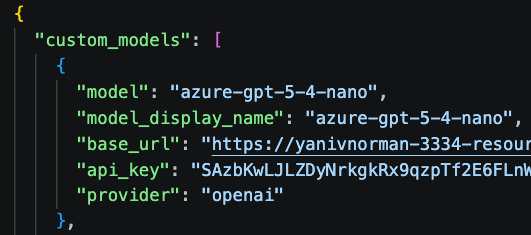
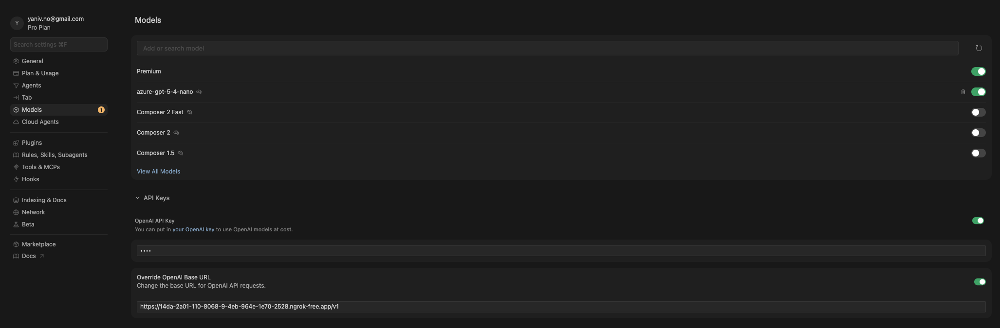

# How to Run for Development

## 1. Start the Bridge

Run the bridge with your Factory config:

```bash
FACTORY_CONFIG='.factory/config.json' node factory-cursor-bridge.mjs 2>&1
```

## 2. Expose with ngrok

Since `127.0.0.1` is blocked in Cursor, use ngrok to expose the bridge:

```bash
ngrok http http://127.0.0.1:8316
```

## 3. Configure Cursor

Configure the model in the bridge:



Configure Placeholder Key (1234) and Override the OpenAI API URL in Cursor settings with your ngrok URL:


